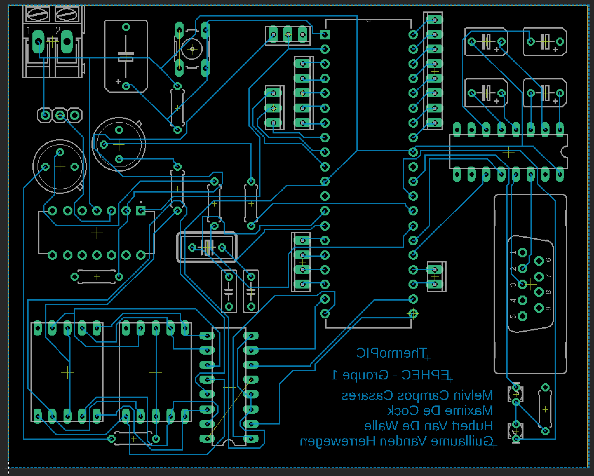

Rapport final - ThermoPIC
=========================

Tout est disponible sur GitHub : <https://github.com/melvinmajor/thermopic>

Introduction
------------

ThermoPIC est un projet consistant en l’application d’une sonde de température envoyant au PIC une mesure analogique de la température ambiante d’une pièce.

Une intégration digitale et un signal d’alerte sont tous deux requis afin de prévenir l’utilisateur de l’éventuel dépassement d’un seuil critique défini par l’utilisateur.
L’intégration digitale est l’affichage de la température sur un afficheur intégré au circuit, tout comme d’un indicateur sur le programme lancé sur l’ordinateur relié au PIC.
Le signal d’alerte n’est autre que l’enclenchement d’une LED de couleur rouge et un message d’alerte sur l’ordinateur relié.

Ce projet est à construire de A à Z, dans le sens où il nous faut schématiser, simuler, mais également programmer l’intégralité du circuit électronique choisi.

### Contraintes

_Certaines contraintes nous ont été imposée._
Tout d’abord, la communication entre le circuit et l’ordinateur doit se faire par le biais d’une application écrite en Java.
De plus, certains composants du circuit sont prédéfinis comme le PIC, la sonde de température, les afficheurs 7 segments et des LED (une rouge et une verte).
La sonde température doit fonctionner dans la gamme de 0°C à 100°C **minimum**, les afficheurs 7 segments doivent servir à l’affichage de la température et les LED aux alertes (LED rouge clignotante si alerte, LED verte continue si aucune alerte en cours).

La programmation du PIC est possible via l’interface RS232 ou via l’utilisation d’un module FTDI permettant la conversion du port série en port mini-USB.

### Matériel nécessaire

1. PIC 18F458
2. Sonde température LM35
3. Amplificateur LM324
4. Crystal XTALS
5. Port série et convertisseur série MAX232
6. Deux afficheurs 7 segments à cathodes communes HD-1103
7. Alimentation 5V
8. Pin Header PINHD-1X3
9. Résistances, bouton poussoir 10-XX, LED rouge et verte LED3MM et/ou LED5MM

### Performance

Nous avons pensé en groupe qu'il serait intéressant de réduire la consommation électrique et le besoin en composants de notre prototype afin que celui-ci respecte au mieux les désires de chacun.
Pour respecter cet engagement, nous avons utilisé un affichage simultané sur deux afficheurs 7 segments et en n'utilisant qu'un seul décodeur à 7 segments.
Grâce à deux transistors, nous parvenons à choisir sur quel afficheur afficher un chiffre.
Si on transit rapidement entre les deux afficheurs, l'impact visuel sera inexistant.
Cette manipulation à permis de réduire de 50% la consommation électrique de l'affichage et l'utilisation d'un seul décodeur 7 segments.

Une autre solution possible, mais plus difficile à mettre en place, serait d'allumer les segments de l'afficheur un par un.
Seulement, cette option n'utiliserait pas un décodeur et donc nous devrions utiliser 7 sorties du PIC.
Cette option n'était donc pas envisageable.

Partie technique
----------------

### Fonctionnement

Le fonctionnement de ce circuit repose sur un programme tournant en boucle, qui va à chaque instant donné, récupérer la valeur de la sonde de température et comparer cette valeur à la température maximale entrée par l'utilisateur via une application Java.
Ce programme va aussi vérifier si une donnée est reçue via son RX envoyée depuis l'application Java vers l'entrée Serial du PIC.

Lors du fonctionnement du circuit, si la température est inférieure à la valeur maximale désirée, une LED verte sera allumée pour signaler que tout va bien.
Si cette température dépasse la valeur maximale, une LED rouge clignotera pour signaler l'utilisateur que la température maximale a été dépassée.
L'interface de l'application Java signalera aussi cette alerte.

#### Mode d'emploi

### Schéma électronique

#### Logique

#### PCB

Schéma de la plaque de tirage PCB réalisé sur Eagle sans l'isolation par souci de clarté dans le rapport :

### Code C

### Code Java

### Tests

Voici les tests effectués et leurs résultats :

### Conformité par rapport au cahier des charges

### Caractéristiques techniques

#### Sonde

#### PIC

#### Modules

#### ...

Partie projet
-------------

### Planning du projet

#### Création d’un groupe de discussion sur Signal (Melvin Campos Casares & Hubert Van de Walle)

_**Créé le 4 février à 17h34**_

Afin de faciliter la communication entre les membres du groupe, nous avons décidé de créer un groupe de discussion sur l’application Signal, développée par Open Whisper Systems.
Il nous permet également de passer des appels groupés tant en vocal qu’en visioconférence.

L’avantage de Signal est son cryptage accru de bout en bout, sa gratuité (sans publicité et pas de collecte d’informations, le développement est maintenu sur base de dons et subventions de la communauté) et le fait qu’il soit Open Source.

#### Création du repository GitHub (Melvin Campos Casares)

_**Créé le 4 février à 18h05**_

Par souci de facilité avec la synchronisation des fichiers, nous utilisons un repository GitHub où nous sommes tous contributeurs.

Le repository est public et accessible à l’adresse suivante : [https://github.com/melvinmajor/thermopic](https://github.com/melvinmajor/thermopic)

#### Création du tableau de planification Trello (Guillaume Vanden Herrewegen)

_**Créé le 5 février à 19h51**_

Afin de mieux coordonner notre planification et de suivre au plus près nos deadlines, nous utilisons la plateforme Trello qui nous a été conseillée lors de la présentation du projet et du cahier des charges.

Le Trello _"ThermoPic project"_ étant privé, il n’y a pas de lien disponible afin d’y accéder à moins d’être invité à le rejoindre.

#### API de gestion de communication sur le port série (Hubert Van de Walle)

_**Finalisé le 6 février**_

Lors de la présentation du projet et du cahier des charges, il nous a été proposé d’utiliser l’API **RxTx** pour gérer la communication sur le port série.
En analysant un peu cette API, nous avons pu remarquer qu’elle n’a plus été mise à jour depuis 6 ans et avons donc préféré trouver une autre API, plus récente, et pouvant convenir au projet.

Hubert à trouvé l’API [jSerialComm](https://github.com/Fazecast/jSerialComm), disponible sur GitHub, et permettant d’[utiliser des évènements](https://github.com/Fazecast/jSerialComm/wiki/Event-Based-Reading-Usage-Example).

#### Schéma technique sur Proteus et Eagle (Maxime de Cock & Guillaume Vanden Herrewegen)

_**Echéance le 8 février à 19h**_ - _**Finalisé le 21 février**_

Le délai ne fut pas respecté, entre autres car nous ne savions pas encore clairement quels composants utiliser plus précisément dans notre circuit, mais également par la difficulté de trouver une version propre de Proteus sans virus et disposant des librairies de base.
Le schéma technique sur _Eagle_ fut achevé le 16 février en courant de journée par Maxime.
Pour ce qui concerne le schéma sur _Proteus_, nous attendions la fin du schéma sur Eagle pour pouvoir l’achever.
Quelques dernières retouches ont été réalisées le 21 février sur Eagle tout comme la finalisation de Proteus, par Maxime.

Quelques modifications mineures ont été apportées par la suite afin d'optimiser au mieux notre plaque de tirage et améliorer quelque peu notre schéma technique.

#### Sélection des composants nécessaires au projet (groupe entier)

_**Finalisé le 17 février**_

Bien qu’un point très important, nous avions fini de choisir les composants nécessaires au projet lorsque nous avions terminé la partie principale du schéma technique sur Eagle.
Lors des cours, nous avons pu remarquer l’intérêt de certains composants et reprendre ces derniers dans notre schéma afin de finaliser correctement la partie technique de l’électronique du projet.

#### Fichier EAGLE (.brd) pour tirage PCB (Melvin Campos Casares)

_**Echéance le 11 mars à 17h**_ - _**Finalisé le 28 février**_

Avec le schéma achevé le 16 février, il n’y avait plus qu’à réaliser le fichier de carte de circuit imprimé (_**.brd**_).
Pour ce faire, nous sommes partis du schéma Eagle et nous nous sommes rendu compte de certaines modifications à apporter au niveau du schéma afin que notre plaque d'impressions soit correcte.
De plus, lors du commencement de la programmation du code C, nous avons pu remarquer également certaines modifications à apporter au niveau des résistances choisies, n'entrainant heureusement pas de nouveaux changements au niveau du fichier servant au tirage PCB.

Quelques modifications mineures ont été apportées par la suite afin d'optimiser au mieux notre plaque de tirage et améliorer quelque peu notre schéma technique.

#### Programmation du code C (groupe entier)

_**Commencé le 6 mars**_

La programmation du code C de ce projet est principalement géré par Guillaume Vanden Herrewegen.
Cela n'empêche que nous nous échangions des informations au fur et à mesure de l'évolution afin de pouvoir avancer lorsque nous rencontrons un problème.

Maxime De Cock à soulevé des points pertinents concernant la partie électronique à devoir tenir compte pour la programmation en C alors que Hubert Van De Walle et Melvin Campos Casares ont plus aidé concernant les choix et directives à prendre afin de contrecarrer certains problèmes rencontrés.
A l'heure actuelle, Guillaume Vanden Herrewegen est la personne principale ayant écrit le code C et ayant réalisé les tests préalables permettant de s'assurer du bon fonctionnement.

#### Rapport intermédiaire (groupe entier)

_**Echéance le 11 mars à 17h**_

Le rapport intermédiaire fut commencé le 8 février et complété au fur et à mesure de l’avancement du projet.
Il a été tenu à jour par tout le groupe et principalement écrit par Melvin sur base des retours des autres membres du groupe.

### Problèmes rencontrés et solutions apportées

#### Programmation

Pour la partie programmation, nous avons décidé de partir d'un circuit vide.
Nous avons ajouté les différentes parties du circuit au fur et à mesure que le code avançait.
La première partie était l’affichage de la température sur les afficheurs 7 segments.
Une fois cette partie fonctionnelle, nous avons travaillé sur l’entrée analogique de la sonde de température.

Nous avons eu quelques difficultés concernant cette partie du code car nous n’arrivions pas à visualiser quelle type de valeur le convertisseur analogique numérique sortait.
Une fois cette valeur « maitrisée », nous l’avons convertie pour qu’elle puisse représenter la température relevée.
Nous avons ensuite pu afficher aisément la température sur les afficheurs 7 segments.

Conclusion
==========

Limites du systèmes et améliorations possibles
----------------------------------------------
