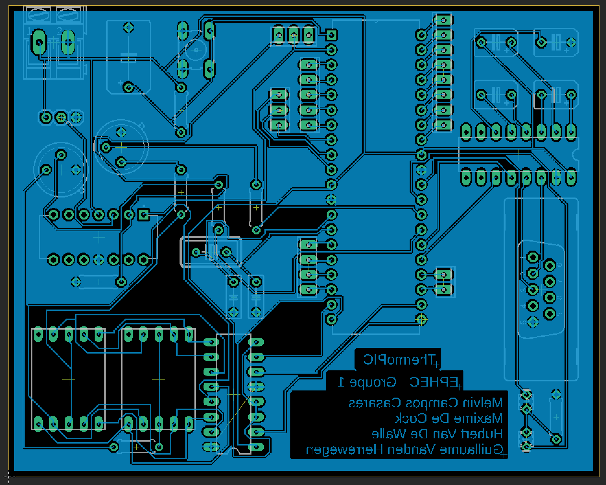

Rapport final - ThermoPIC
=========================

Introduction
------------

ThermoPIC est un projet consistant en l’application d’une sonde de température envoyant au PIC une mesure analogique de la température ambiante d’une pièce.

Une intégration digitale et un signal d’alerte sont tous deux requis afin de prévenir l’utilisateur de l’éventuel dépassement d’un seuil critique défini par l’utilisateur.
L’intégration digitale est l’affichage de la température sur un afficheur intégré au circuit, tout comme d’un indicateur sur le programme lancé sur l’ordinateur relié au PIC.
Le signal d’alerte n’est autre que l’enclenchement d’une LED de couleur rouge et un message d’alerte sur l’ordinateur relié.

Ce projet est à construire de A à Z, dans le sens où il nous faut schématiser, simuler, mais également programmer l’intégralité du circuit électronique choisi.

### Contraintes

_Certaines contraintes nous ont été imposée._
Tout d’abord, la communication entre le circuit et l’ordinateur doit se faire par le biais d’une application écrite en Java.
De plus, certains composants du circuit sont prédéfinis comme le PIC, la sonde de température, les afficheurs 7 segments et des LED (une rouge et une verte).
La sonde température doit fonctionner dans la gamme de 0°C à 100°C **minimum**, les afficheurs 7 segments doivent servir à l’affichage de la température et les LED aux alertes (LED rouge clignotante si alerte, LED verte continue si aucune alerte en cours).

La programmation du PIC est possible via l’interface RS232 ou via l’utilisation d’un module FTDI permettant la conversion du port série en port mini-USB.

### Matériel nécessaire

1. PIC 18F458
2. Sonde température LM35
3. Amplificateur LM324
4. Crystal XTALS
5. Port série et convertisseur série MAX232
6. Deux afficheurs 7 segments à cathodes communes HD-1103
7. Alimentation 5V
8. Pin Header PINHD-1X3
9. Résistances, bouton poussoir 10-XX, LED rouge et verte LED3MM et/ou LED5MM

### Performance

Nous avons pensé en groupe qu'il serait intéressant de réduire la consommation électrique et le besoin en composants de notre prototype afin que celui-ci respecte au mieux les désires de chacun.
Pour respecter cet engagement, nous avons utilisé un affichage simultané sur deux afficheurs 7 segments et en n'utilisant qu'un seul décodeur à 7 segments.

Grâce à deux transistors, nous parvenons à choisir sur quel afficheur afficher un chiffre.
Si on transite rapidement entre les deux afficheurs, l'impact visuel sera inexistant.
Cette manipulation à permis de réduire de 50% la consommation électrique de l'affichage et l'utilisation d'un seul décodeur 7 segments.

Une autre solution possible, mais plus difficile à mettre en place, serait d'allumer les segments de l'afficheur un par un.
Seulement, cette option n'utiliserait pas un décodeur et donc nous devrions utiliser 7 sorties du PIC.
Cette option n'était donc pas envisageable étant donné la taille de la plaque et la place à prévoir pour toutes les connexions ainsi que tous les composants.

Partie technique
----------------

### Fonctionnement

Le fonctionnement de ce circuit repose sur un programme tournant en boucle, qui va à chaque instant donné, récupérer la valeur de la sonde de température et comparer cette valeur à la température maximale entrée par l'utilisateur via une application Java.
Ce programme va aussi vérifier si une donnée est reçue via son RX envoyée depuis l'application Java vers l'entrée Serial du PIC.

Lors du fonctionnement du circuit, si la température est inférieure à la valeur maximale désirée, une LED verte sera allumée pour signaler que tout va bien.
Si cette température dépasse la valeur maximale, une LED rouge clignotera pour signaler l'utilisateur que la température maximale a été dépassée.
L'interface de l'application Java signalera aussi cette alerte.

#### Mode d'emploi

L'utilisation du prototype est extrêmement simple.
Il suffit d'alimenter en 5V la plaque et de relier le prototype à un ordinateur via un câble sérial.
Des adaptateurs Série vers USB est l'idéal si l'ordinateur ne dispose pas de port série.

Ensuite il faut lancer l'application Java qui permettra de surveiller et de configurer l'alarme à distance.

Dans le cas où vous n'avez pas une version sufisamment récente de Java, nous vous conseillons d'installer au minimum la version **OpenJDK 11 (LTS)** _(JVM **HotSpot**)_ disponible sur AdoptOpenJDK (Windows/Mac/Linux) : <https://adoptopenjdk.net/>

### Schéma électronique

#### Logique


#### PCB




### Code C

#### main.h

```C
#include <18F458.h>
#device ADC=10

#FUSES NOWDT                    /*No Watch Dog Timer*/

#use delay(crystal=20000000)

#define LED PIN_D4
#define DELAY 1000
```

#### code.c

```C
/*================================================================
Code from:
- Maxime De Cock
- Melvin Campos
- Hubert Van De Walle
- Guillaume Vanden Herrewegen

Used for Thermopic project with 18f458 microship
==================================================================*/

#include <main.h>
#use rs232(baud=57600,parity=N,xmit=PIN_C6,rcv=PIN_C7,bits=8)

char buffer[1];

#int_rda
void isr(){
   disable_interrupts(INT_RDA);
   gets(buffer);
}

/*
   Cette fonction permet de sortir un nombre sur 4 pins au lieu de 8
*/
void sortie(int nbr){
   switch(nbr){
         case 0 :  output_low(pin_d0);
                   output_low(pin_d1);
                   output_low(pin_d2);
                   output_low(pin_d3);
                   break;
         case 1 :  output_high(pin_d0);
                   output_low(pin_d1);
                   output_low(pin_d2);
                   output_low(pin_d3);
                   break;
         case 2 :  output_low(pin_d0);
                   output_high(pin_d1);
                   output_low(pin_d2);
                   output_low(pin_d3);
                   break;
         case 3 :  output_high(pin_d0);
                   output_high(pin_d1);
                   output_low(pin_d2);
                   output_low(pin_d3);
                   break;
         case 4 :  output_low(pin_d0);
                   output_low(pin_d1);
                   output_high(pin_d2);
                   output_low(pin_d3);
                   break;
         case 5 :  output_high(pin_d0);
                   output_low(pin_d1);
                   output_high(pin_d2);
                   output_low(pin_d3);
                   break;
         case 6 :  output_low(pin_d0);
                   output_high(pin_d1);
                   output_high(pin_d2);
                   output_low(pin_d3);
                   break;
         case 7 :  output_high(pin_d0);
                   output_high(pin_d1);
                   output_high(pin_d2);
                   output_low(pin_d3);
                   break;
         case 8 :  output_low(pin_d0);
                   output_low(pin_d1);
                   output_low(pin_d2);
                   output_high(pin_d3);
                   break;
         case 9 :  output_high(pin_d0);
                   output_low(pin_d1);
                   output_low(pin_d2);
                   output_high(pin_d3);
                   break;
   }
}

/*
   Cette fonction permet d'afficher sur 2 afficheurs 7 segments à cathodes communes un nombre à 2 chiffres décimaux
*/
void affiche(int nbr){
   int nbr1 = nbr/10;
   int nbr2 = nbr%10;
   output_high(pin_d4);
   output_low(pin_d5);
   sortie(nbr1);
   delay_ms(10);
   output_high(pin_d5);
   output_low(pin_d4);
   sortie(nbr2);
   delay_ms(10);
   delay_ms(10);   
}

void ledRedOn(){
   output_high(pin_d6);
}

void ledRedOff(){
   output_low(pin_d6);
}

void ledGreenOn(){
   output_high(pin_d7);
}

void ledGreenOff(){
   output_low(pin_d7);
}

void main(){
   unsigned long temp;
   long affTemp;
   
   setup_adc(ADC_CLOCK_DIV_32); //configure analog to digiral converter
   setup_adc_ports(ALL_ANALOG); 
   set_adc_channel(0);
   output_high(pin_e0);
   
   int temperatureAlerte = 25;   // température maximale
   
   while(TRUE){
      set_adc_channel(0);//set the pic to read from AN0
      delay_us(10);//delay 10 microseconds to allow PIC to switch to analog channel 0
      temp=read_adc()/10; //read input from pin AN0: 0<=photo<=255
      
      affTemp = temp;
      
      if(temp>25 && temp<69){
         affTemp = temp - 1;
         affiche(affTemp);
         if(affTemp > temperatureAlerte){
            ledRedOn();
            ledGreenOff(); 
         //printf("%c", buffer[0]);
         }
         else{
            ledRedOff();
            ledGreenOn();
         //printf("%c", buffer[0]);
         }
      }
      else if(temp>69){
         affTemp = temp - 2;
         affiche(affTemp);
         if(affTemp > temperatureAlerte){
            ledRedOn();
            ledGreenOff(); 
         //printf("%c", buffer[0]);
         }
         else{
            ledRedOff();
            ledGreenOn();
         //printf("%c", buffer[0]);
         }
      }
      else{
         affiche(affTemp);
         if(affTemp > temperatureAlerte){
            ledRedOn();
            ledGreenOff();
         //printf("%c", buffer[0]);            
         }
         else{
            ledRedOff();
            ledGreenOn();
         //printf("%c", buffer[0]);
         }
      }
      delay_ms(10);
   }
}
```

### Code Java

### Tests

Voici les tests effectués et leurs résultats :

1. _**Vérification de toutes les connexions sur la plaque PCB avant impression**_
   Cette vérification à été faite afin d'être sûr qu'il n'y ait pas de pont entre deux connexions.
   Cela à impliqué quelques changements au niveau conception afin d'avoir suffisamment de place pour que toutes les _routes_ aient leur place.
2. _**Simulation du code C sous Proteus**_
   Test du code C élément par élément, aucun problème rencontré.
   Une fois le code C simulé sur la totalité du circuit, nous avons remarqué une plage non fonctionnelle entre 0° et 10° dû à une différence de tension trop faible pour que le convertisseur le détecte.

### Conformité par rapport au cahier des charges

Tous les composants précisé dans le cahier des charges ont été tenu en compte et sont présent sur ThermoPIC.
Comme remarqué sur les différents schémas disponible plus tôt dans ce rapport, nous utilisons les composants suivants :

- PIC 18f458,
- Sonde température LM35,
- Amplificateur LM324,
- 2 afficheurs 7 segments (pour montrer la température depuis la plaque),
- LED rouge et verte (signale l'état du seuil si atteint ou non),
- Résistances, condensateurs, crystal, bouton poussoir, pin header,
- Connecteur RS232 avec convertisseur série MAX232 (contrainte provenant du PIC).

La plaque PCB est conforme aux dimensions prescrites et il y a présence d'une plaque terre entourant le circuit afin de limiter les perturbations électriques et donc, de l'isoler.

La programmation C, en mode simulation, fonctionne sans le moindre problème en dehors dd la plage 0-10° comme expliqué dans les tests.

Partie projet
-------------

### Planning du projet

Dans le tableau ci-dessous, la personne principalement en charge est celle indiqué en **gras**.

Date | Description | Personne en charge
-----|-------------|-------------------
04/02/2019 | _Création du groupe de discussion sur Signal_ | **Hubert** & Melvin
04/02/2019 | _Création du [repository GitHub](https://github.com/melvinmajor/thermopic)_ | **Melvin**
05/02/2019 | _Création du [tableau de planification privé Trello](https://trello.com/b/enrK0mAl/thermopic-project)_ | **Guillaume**
06/02/2019 | _Choix de l'API de communication sur port série_ | **Hubert**
08/02/2019 > 21/02/2019 | _Schéma technique Proteus et Eagle_ | **Maxime** & Guillaume
17/02/2019 | _Sélection des composants électronique_ | Groupe entier (**Maxime**)
28/02/2019 | _Fichier EAGLE (.brd) pour tirage PCB_ | **Melvin**
06/03/2019 > 19/05/2019 | _Programmation Java_ | Groupe entier (**Hubert**)
09/03/2019 > 14/05/2019 | _Programmation C_ | Groupe entier (**Guillaume**)
11/03/2019 | _Rapport intermédiaire_ | Groupe entier (**Melvin**)
26/03/2019 > 30/04/2019 | _Soudures de plaque PCB_ | **Guillaume**, Maxime, **Melvin**
20/05/2019 | _Rapport final_ | Groupe entier (**Melvin**)

#### Création d’un groupe de discussion sur Signal (Melvin Campos Casares & Hubert Van de Walle)

_**Créé le 4 février à 17h34**_

Afin de faciliter la communication entre les membres du groupe, nous avons décidé de créer un groupe de discussion sur l’application Signal, développée par Open Whisper Systems.
Il nous permet également de passer des appels groupés tant en vocal qu’en visioconférence.

L’avantage de Signal est son cryptage accru de bout en bout, sa gratuité (sans publicité et pas de collecte d’informations, le développement est maintenu sur base de dons et subventions de la communauté) et le fait qu’il soit Open Source.

#### Création du repository GitHub (Melvin Campos Casares)

_**Créé le 4 février à 18h05**_

Par souci de facilité avec la synchronisation des fichiers, nous utilisons un repository GitHub où nous sommes tous contributeurs.

Le repository est public et accessible à l’adresse suivante : [https://github.com/melvinmajor/thermopic](https://github.com/melvinmajor/thermopic)

#### Création du tableau de planification privé Trello (Guillaume Vanden Herrewegen)

_**Créé le 5 février à 19h51**_

Afin de mieux coordonner notre planification et de suivre au plus près nos deadlines, nous utilisons la plateforme Trello qui nous a été conseillée lors de la présentation du projet et du cahier des charges.

Le Trello [_"ThermoPic project"_](https://trello.com/b/enrK0mAl/thermopic-project) étant privé, il n’y a pas de lien disponible à moins d’être invité à le rejoindre.

#### API de gestion de communication sur le port série (Hubert Van de Walle)

_**Finalisé le 6 février**_

Lors de la présentation du projet et du cahier des charges, il nous a été proposé d’utiliser l’API **RxTx** pour gérer la communication sur le port série.
En analysant un peu cette API, nous avons pu remarquer qu’elle n’a plus été mise à jour depuis 6 ans et avons donc préféré trouver une autre API, plus récente, et pouvant convenir au projet.

Hubert à trouvé l’API [jSerialComm](https://github.com/Fazecast/jSerialComm), disponible sur GitHub, et permettant d’[utiliser des évènements](https://github.com/Fazecast/jSerialComm/wiki/Event-Based-Reading-Usage-Example).

#### Schéma technique sur Proteus et Eagle (Maxime de Cock & Guillaume Vanden Herrewegen)

_**Echéance le 8 février à 19h**_ - _**Finalisé le 21 février**_

Le délai ne fut pas respecté, entre autres car nous ne savions pas encore clairement quels composants utiliser plus précisément dans notre circuit, mais également par la difficulté de trouver une version propre de Proteus sans virus et disposant des librairies de base.
Le schéma technique sur _Eagle_ fut achevé le 16 février en courant de journée par Maxime.
Pour ce qui concerne le schéma sur _Proteus_, nous attendions la fin du schéma sur Eagle pour pouvoir l’achever.
Quelques dernières retouches ont été réalisées le 21 février sur Eagle tout comme la finalisation de Proteus, par Maxime.

Quelques modifications mineures ont été apportées par la suite afin d'optimiser au mieux notre plaque de tirage et améliorer quelque peu notre schéma technique.

#### Sélection des composants nécessaires au projet (Groupe entier)

_**Finalisé le 17 février**_

Bien qu’un point très important, nous avions fini de choisir les composants nécessaires au projet lorsque nous avions terminé la partie principale du schéma technique sur Eagle.
Lors des cours, nous avons pu remarquer l’intérêt de certains composants et reprendre ces derniers dans notre schéma afin de finaliser correctement la partie technique de l’électronique du projet.

#### Fichier EAGLE (.brd) pour tirage PCB (Melvin Campos Casares)

_**Echéance le 11 mars à 17h**_ - _**Finalisé le 28 février**_ - _**Modifications mineures le 12 mars avant impression**_

Avec le schéma achevé le 16 février, il n’y avait plus qu’à réaliser le fichier de carte de circuit imprimé (_**.brd**_).
Pour ce faire, nous sommes partis du schéma Eagle et nous nous sommes rendu compte de certaines modifications à apporter au niveau du schéma afin que notre plaque d'impressions soit correcte.
De plus, lors du commencement de la programmation du code C, nous avons pu remarquer également certaines modifications à apporter au niveau des résistances choisies, n'entrainant heureusement pas de nouveaux changements au niveau du fichier servant au tirage PCB.

Quelques modifications mineures ont été apportées par la suite afin d'optimiser au mieux notre plaque de tirage et améliorer quelque peu notre schéma technique suite aux retours données par Eurocircuit.

#### Rapport intermédiaire (Groupe entier)

_**Echéance le 11 mars à 17h**_

Le rapport intermédiaire fut commencé le 8 février et complété au fur et à mesure de l’avancement du projet.
Il a été tenu à jour par tout le groupe et principalement écrit par Melvin sur base des retours des autres membres du groupe.

#### Programmation du code Java (Groupe entier)

_**Commencement prévu le 6 mars**_ - _**Commencé le 17 mai**_ - _**Finalisé le 19 mai**_

La programmation du code Java de ce projet est principalement géré par Hubert Van De Walle.
Cela n'empêche que nous nous échangions des informations au fur et à mesure de l'évolution du projet afin de pouvoir centraliser toutes les informations avant le début de la programmation.

Hubert ayant mis en avant l'intérêt pour l'utilisation d'une API plus pertinente dans le cadre de l'intéraction entre la programmation C et la programamtion Java, il est la personne idéale pour gérer la programmation Java.

Malheureusement, _Hubert a préféré attendre la fin de la programmation du code C avant de commencer la programmation du code Java_, entraînant un retard conséquent malgré les nombreux avertissements des autres membres du groupe et le désir de chacun de déjà entamer cette partie.
De plus, par ce retard généré, nous n'avons pas utilisé l'API `jSerialComm` pourtant soulevé par Hubert au début du projet.
Nous nous sommes rabattu sur l'API `RxTx`, plus aisé à implémenter étant donné sa présence plus longue en ligne et, par conséquent, une documentation et de nombreux exemples disponible en ligne.
Cela dit, malgré les quelques jours restants avant la fin du projet, nous avons tout mis en place afin de terminer cette partie et commencer les simulations et tests durant le peu de temps imparti.

#### Programmation du code C (Groupe entier)

_**Commencé le 9 mars**_ - _**Finalisé le 14 mai**_

La programmation du code C de ce projet est principalement géré par Guillaume Vanden Herrewegen.
Cela n'empêche que nous nous échangions des informations au fur et à mesure de l'évolution afin de pouvoir avancer lorsque nous rencontrons un problème.

Maxime De Cock à soulevé des points pertinents concernant la partie électronique à devoir tenir compte pour la programmation en C alors que Hubert Van De Walle et Melvin Campos Casares ont plus aidé concernant les choix et directives à prendre afin de contrecarrer certains problèmes rencontrés.
Guillaume Vanden Herrewegen est la personne principale ayant écrit le code C et ayant réalisé les tests préalables permettant de s'assurer du bon fonctionnement.

Initialement prévu le 24 février, le commencement de la programmation C fut le 9 mars suite à un retard occasionné par le schéma Proteus à finaliser.

#### Soudures de plaque PCB (Groupe entier)

_**Commencé le 26 mars**_ - _**Finalisé le 30 avril**_

Guillaume Vanden Herrewegen et Melvin Campos Casares sont les personnes principalement en charge des soudures sur la plaque PCB.

Nous avons réalisé les soudures principalement lors de moments prévu dans le cadre des cours pratique d'_électronique digital et analyse des signaux_.

Maxime De Cock, Guillaume Vanden Herrewegen et Melvin Campos Casares se sont organisé pour se voir pendant les vacances de Pâques afin d'avancer encore un peu dans le cadre des soudures et réaliser une première étape des vérifications des soudures déjà réalisée.

Melvin à par ailleurs finalisé les vérifications des soudures chez lui après l'entrevue avec Maxime et Guillaume.

Le groupe au complet à refait une dernière vérification après les dernières soudures le 30 avril et nous nous sommes rendu compte d'une connexion ne se réalisant pas.
Cela à impliqué le besoin de mettre en place un câble en cuivre afin que la connexion puisse se faire entre la puce RS232 et un des condensateurs.

#### Rapport final (Groupe entier)

_**Echéance le 20 mai**_

Le rapport final fut commencé après la remise du rapport intermédiaire.
Nous sommes parti du rapport intermédiaire et avons supprimé les parties qui n'étaient plus pertinent et avons ajouté au fur et à mesure les nouveaux éléments demandés.

Il a été tenu à jour et écrit par Melvin sur base des retours des autres membres du groupe.

### Problèmes rencontrés et solutions apportées

#### Compréhension du fonctionnement des composants

Lors de la conception des schémas sur Eagle et Proteus, nous avons été quelque peu ralenti car nous tentions de comprendre le fonctionnement du PIC 18F458 ainsi que de certains autres composants.

Avec les fiches techniques des différents composants (présent sur notre GitHub), nous avons reglé ce problème.

#### Diminution du nombre de résistances

Nous utilisions au départ 7 résistances pour les afficheurs 7 segments.
En ne mettant qu'une seule résistance sur la cathode commune des afficheurs 7 segments, cela permets de réduire le nombre de résistances utilisées, réduire les coûts mais malgré tout garder un minimum de protection.
Etant donné que nous n'envoyons pas de valeurs excessives, cette solution à été appliquée lors de la création de la plaque de tirage PCB.

#### Réglage du logiciel Eagle

Pour que le tirage de notre plaque électronique puisse se faire sans encombre, il nous a fallu changer certains réglages du logiciel Eagle.

En effet, lors de la première remise de notre PCB, il s'avère que nos _routes_ soient trop fines afin d'être correctement imprimé par **EuroCircuit**.
Nous avons adapté certains réglages et réalisé à nouveau les _routes_ afin que notre carte électronique soient accepté par l'entreprise d'impression PCB.

#### Programmation

Pour la partie programmation, nous avons décidé de partir d'un circuit vide.
Nous avons ajouté les différentes parties du circuit au fur et à mesure que le code avançait.
La première partie était l’affichage de la température sur les afficheurs 7 segments.
Une fois cette partie fonctionnelle, nous avons travaillé sur l’entrée analogique de la sonde de température.

Nous avons eu quelques difficultées concernant cette partie du code car nous n’arrivions pas à visualiser quelle type de valeur le convertisseur analogique numérique sortait.
Une fois cette valeur « maitrisée », nous l’avons convertie pour qu’elle puisse représenter la température relevée.
Nous avons ensuite pu afficher aisément la température sur les afficheurs 7 segments.

#### Soudures de la plaque PCB

Le groupe au complet à fait une dernière vérification après les dernières soudures le 30 avril et nous nous sommes rendu compte d'une connexion ne se réalisant pas.
Cela a impliqué le besoin de mettre en place un câble en cuivre afin que la connexion puisse se faire entre la puce RS232 et un des condensateurs.

Nous avons également rajouté 2 connexions par un câble de cuivre car nous avions un soupçon concernant la fiabilité des soudures concernées. 

#### Court-circuit dans la plaque PCB

Nous avons détecté un court-circuit au niveau de la plaque PCB bien que toutes les soudures soient correctes et vérifiées.
Cela explique l'impossibilité de flasher le PIC et également de tester concrètement et hors simulation notre projet fini.

Pour tenter de trouver la solution, voici les différentes étapes réalisées :

    * Vérification de toutes les soudures via un test de connectivité.
    * Mise en place de câbles pour remplacer des soudures imparfaites.
    * Vérification du fonctionnement de chaque composant du circuit.
    * Vérification du circuit au complet sur base du schéma Eagle.
    * Vérification du circuit au complet sur base de la simulation Proteus.

Aucune solution n'a été trouvée suite à toutes ces recherches.

Objectifs personnels et attentes
================================

Melvin Campos Casares
---------------------

Pour ce projet, j'espérais grandement pouvoir enfin comprendre l'utilisation de certains logiciels d'électronique permettant la création d'un schéma ainsi que sa manipulation via simulation.
De plus, avoir un bon travail d'équipe et s'assurer de tout terminer à temps et à heure pour l'échéance finale est l'un de mes objectifs prioritaires.

N'ayant pas de facilité à la programmation en C, pouvoir discuter de certains points me paraissant plus obscurs avec les autres membres du groupe afin de mieux comprendre et mieux visualiser ce langage est un de mes objectifs _bonus_.

Mêler de la programmation avec de l'électronique et obtenir quelque chose de concret et fonctionnel au quotidien est mon attente principale pour ce projet.

Maxime de Cock
--------------

Dès l'annonce du projet, j'ai été très enthousiaste à l'idée de faire ce montage, j'ai donc demandé à mes coéquipiers de me laisser la partie schéma électronique.

J'aime vraiment ça, c'est pourquoi j'attends beaucoup de ce projet, entre l'apprentissage des différents langages/programmes et la compréhension des datasheet, ce sont mes premiers vrais objectifs.

Hubert Van De Walle
-------------------

L’existence d’un projet tel que celui-ci en deuxième année des études TI me semble indispensable.
En effet, il m'a permis d'avoir une meilleure idée de l'interaction entre l'électronique et la programmation.
J'ai également découvert les différentes étapes rentrant dans la réalisation d'un circuit imprimé.
De plus, ne pas se limiter à la théorie et réaliser un projet concret m’a permis, personnellement, de renforcer mon intérêt envers l'électronique.

Guillaume Vanden Herrewegen
---------------------------

Ayant déjà réalisé des projets en électronique de type Arduino, j'étais vraiment intéressé par ce projet. De plus, nous allions apprendre à manipuler des programmes qui permettent de simuler un circuit électronique.

Grâce à ce projet, j'espère pouvoir m'améliorer dans la gestion de groupe, mais aussi dans l'amélioration de mes compétences en électronique ainsi que pouvoir, suite à l'analyse d'une demande, concevoir et assembler un prototype d'un projet en électronique.

Conclusion
==========

Nous avons certes eux des problèmes d'organisation dû, entre autres, par d'autres projets en parallèle mais nous nous en sommes bien sorti pour rattraper ce retard généré au début de ThermoPIC et avons tout mis en oeuvre pour mener à bien ce dernier.

De plus, la communication entre tous les membres du projet fut l'un de nos atouts majeurs afin d'avancer rapidement et bien.
Il n'a pas été difficile de se concerter afin de planifier des moments de rassemblement pour discuter du projet et avancer sur certains points (soudures, tests accrus de certaines parties du code C, explication de certaines parties moins claires pour certains membres du groupe, etc.)

Le fait qu'il y ait un court-circuit sur la plaque nous contraint à ne pas voir le fruit de notre travail mais les simulations nous prouvent bel et bien la viabilité de ThermoPIC.

En réalisant une nouvelle plaque, il est quasi certain que ThermoPIC verra le jour et soit totalement opérationnel.

Conclusion personnelle
----------------------

### Melvin Campos Casares

J'ai trouvé ce projet très intéressant, tant par l'approche différente et plus technique que par l'évolution du projet en lui-même.
Le fait de réaliser la conception et la réalisation m'a beaucoup attiré.

Je trouve dommage que Hubert n'ai pas voulu qu'on commence la partie Java à programmer alors qu'on aurait pu le commencer bien plus tôt.
Nous aurions pu passer un peu de temps également pour améliorer l'apparence globale de notre programme plutôt que de réaliser quelque chose de simple et fonctionnel dû à un manque de temps pour l'analyse et la conception de la programmation Java.

Quoi qu'il en soit, nous avons globalement bien travaillé en équipe et avons fait notre possible pour mener au mieux ce projet.

### Maxime De Cock

Après avoir fait mon travail, faire le schématique eagle, j'étais content que notre projet avance. 
Cependant, après plusieurs relecture du schéma je ne vois pas les erreurs, et pourtant notre PCB ne fonctionnne pas, ça n'a pas l'air d'être un court-circuit, notre plaque est bien soudé et nous avons testé chaque connexion.

À part cette mésaventure, le projet s'est bien déroulé, nous nous sommes équitablement partagé les tâches. 
Je suis un peu déçu du résultat, mais bon, le projet n'est pas totalement un échec, alors, positivons en attendant la note. 
 

### Hubert Van De Walle

### Guillaume Vanden Herrewegen

Limites du systèmes et améliorations possibles
----------------------------------------------

### Rendre la plaque moins énergivore

En ajoutant une puce LM555 connectée à la LED rouge, la LED clignote sans pour autant éteindre le signal de base.
Une interprétation sur base d'une fonction dans la puce permet, sur base d'une valeur simple envoyée à la LM555, de gérer l'intéraction avec la LED.
Par conséquent, l'envoi d'un signal constant permet de réduire la consommation énergétique puisque la LM555 enverra le signal rapide afin de faire clignoter la LED.

Nous aurions pu également utiliser la LM555 pour les afficheurs 7 segments afin d'envoyer un signal constant et, par ce biais, faire en sorte que cette puce gère l'affichage des valeurs sur les afficheurs.

### Amélioration liée à la LM324

En utilisant une autre puce que la LM324, nous aurions pu éviter le fait que la LM324 renvoie une valeur entre 0 et 4V impliquant une conversion dans le code insérée dans le PIC 18F458.
Cela aurait pu alléger la programmation C.

Bibliographie
=============

Divers sites ont été parcouru afin de comprendre correctement les logiciels utilisé ainsi que pour certains besoins plus spécifiques lors de la programmation C.
De plus, le livre de cours à également servi comme support principal au niveau de certaines data sheet (d'autres ont été prises par la suite pour compléter certaines informations).

Pour la compréhension du port série au sein de Proteus, nous nous sommes appuyé sur le site suivant : <https://www.studentcompanion.net/fr/communication-serie-rs232-avec-microcontroleur-pic-xc8/>

Data Sheet
----------

Tous les data sheet (= fiches techniques) sont disponible sur notre GitHub dans `doc>datasheets`.

- LM35 : National Semiconductor, Texas Instruments
- LM324 : Fairchild, Motorola
- MAX232 : Maxime Integrated
- PIC 16F87xA : Microchip
- PIC 18Fxx8 : Microchip

Logiciels
---------

- Eagle : <https://www.autodesk.com/products/eagle/overview>
- Proteus : <https://www.labcenter.com/>
- PIC C Compiler
- Tiny Multi Bootloader: <https://github.com/bobc/Tiny-Multi-Bootloader>
- JetBrains IntelliJ IDEA Community : <https://www.jetbrains.com/idea/>
